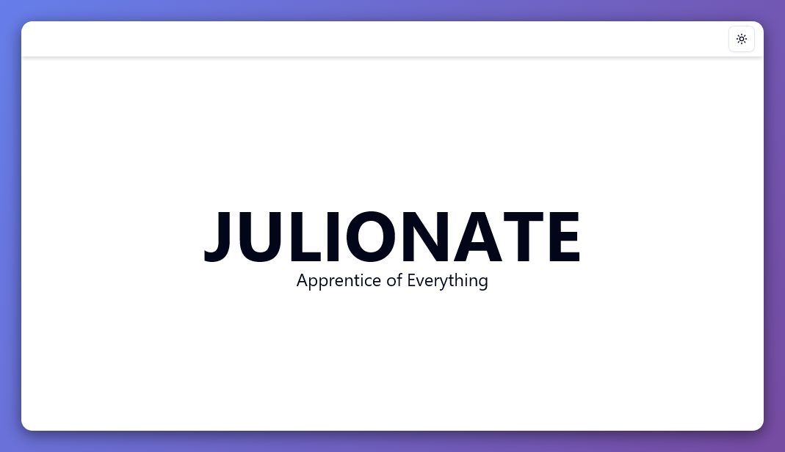

# Julionate Portfolio Website

Welcome to my portfolio! Here you can explore all my projects, skills, and interests.
Check it out here: [Julionate – Portfolio](https://google.com)

# Commands

## Astro Development

| Command        | Action                                         |
| :------------- | :--------------------------------------------- |
| `pnpm install` | Install all dependencies                       |
| `pnpm dev`     | Start the local dev server at `localhost:4321` |
| `pnpm build`   | Build the project for production               |

## Shadcn (Alias)

| Command       | Action                                                                                                      |
| :------------ | :---------------------------------------------------------------------------------------------------------- |
| `pnpm shadcn` | Alias for `pnpm dlx shadcn@latest`. Use it to add components quickly, for example: `pnpm shadcn add button` |

## Formatter (Biome)

| Command           | Action                                            |
| :---------------- | :------------------------------------------------ |
| `pnpm lint`       | Check for errors                                  |
| `pnpm lint:fix`   | Apply safe fixes for errors                       |
| `pnpm format`     | Check code formatting and style                   |
| `pnpm format:fix` | Apply code formatting                             |
| `pnpm check`      | Check for errors and formatting issues            |
| `pnpm check:fix`  | Apply safe fixes for errors and formatting issues |